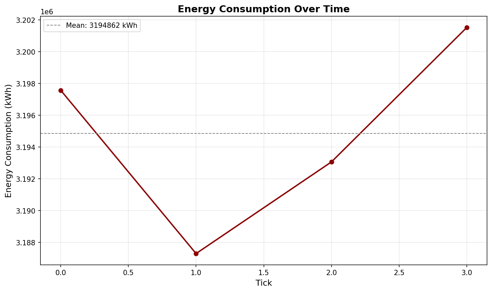
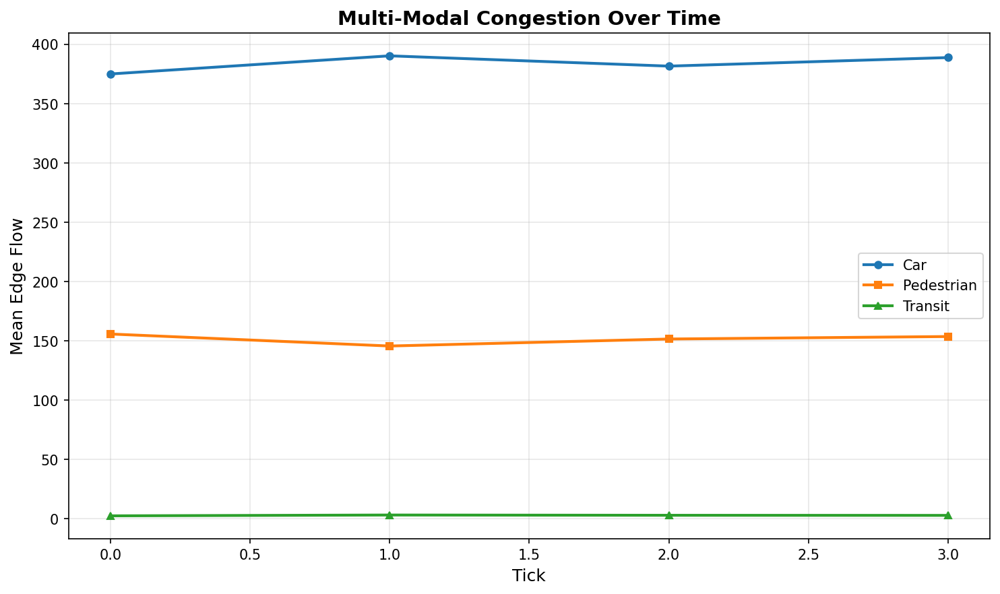
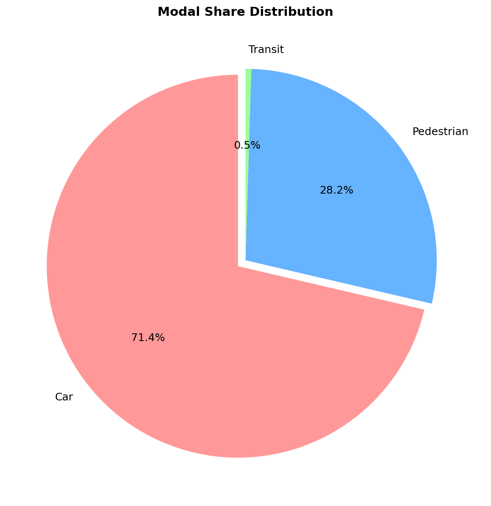

# Simulation Report - Run 3

Generated: 2026-01-06 18:21:28

## Summary Metrics

| Metric | Value |
|--------|-------|
| Run ID | 3 |
| Simulation Ticks | 4 |
| Total Trips | 1,471,246 |
| Avg Energy (kWh/tick) | 3,194,862 |
| Peak Energy (kWh) | 3,201,528 |
| Car Modal Share | 71.4% |
| Pedestrian Modal Share | 28.2% |
| Transit Modal Share | 0.5% |
| Avg Car Congestion | 383.89 |
| Avg Ped Congestion | 151.47 |
| Avg Transit Congestion | 2.59 |


## Configuration

```json
{
  "seed": 42,
  "grid": {
    "width": 20,
    "height": 20,
    "spacing": 1.0,
    "diagonal": false,
    "edge_keep": 0.9,
    "diag_keep": null
  },
  "traffic": {
    "trips_per_person": 0.3,
    "mode": "multimodal_overlay",
    "shares": {
      "car": 0.65,
      "ped": 0.25,
      "transit": 0.1
    }
  }
}
```

## Visualizations

### Energy Consumption



### Congestion Analysis



### Modal Share



## Analysis

**Energy Consumption**: The simulation averaged 3,194,862 kWh per tick with a peak of 3,201,528 kWh.

**Modal Distribution**: Car was the dominant mode at 71.4% of total trips.

**Congestion**: Car showed the highest average congestion at 383.89 mean edge flow.